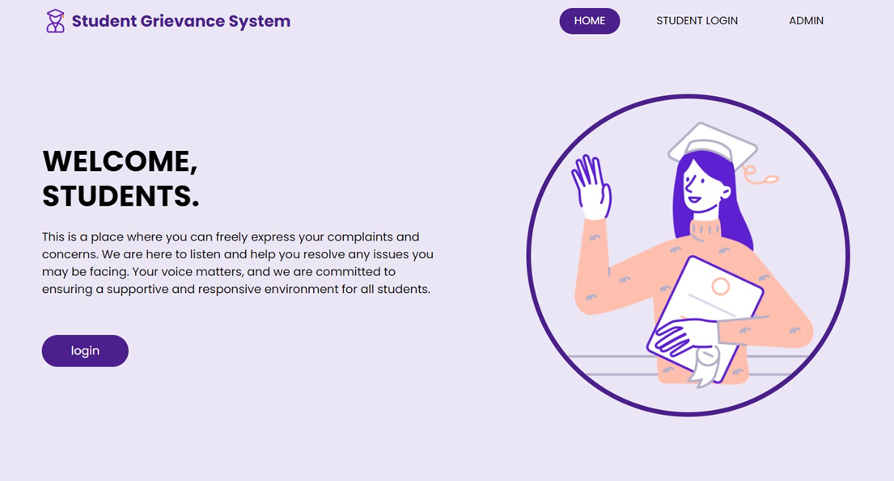
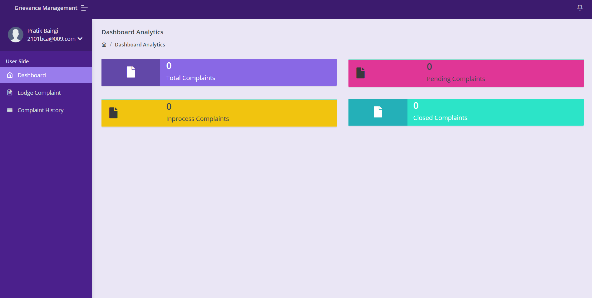

<h1 align="center" style="font-family: Arial, sans-serif; color: #FF6F61; text-shadow: 2px 2px 4px rgba(0,0,0,0.5);">
  Grievance-management-system
</h1>

  
  
  
  
  
  
  
  
  
  
  

A web application for students and teachers to manage grievances, with user-friendly interface managing complains become much more easier for student. Also for teachers, keeping records are now hassle-free.

## Screenshots

  
  

