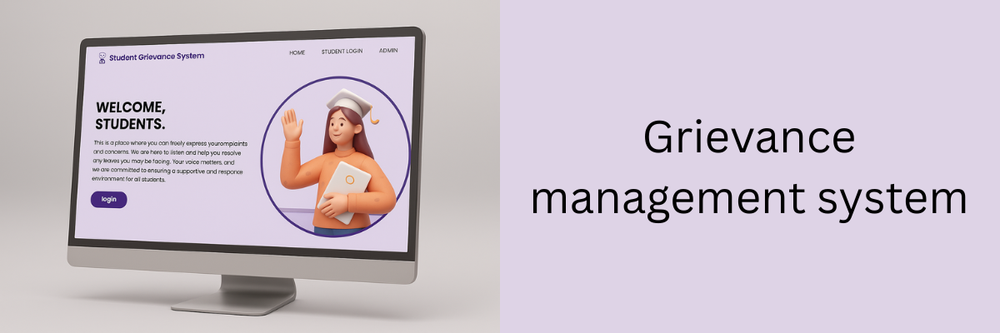

  

<h1 align="center" style="font-family: Arial, sans-serif; color: #FF6F61; text-shadow: 2px 2px 4px rgba(0,0,0,0.5);">
  Grievance-management-system
</h1>

  
  
  
  
  
  
  
  
  
  
  
  

Student‑teacher grievance management system using PHP/MySQL

## Screenshots🖼️

  
  

## Features🛠️

- User-friendly interface
- Easy login and sign-up process
- Register and manage grievance
- Check status
- Keeping records seperatly
- Fetch grievances by just student id or grievance id
- Easy to maintain

## Requirement/Installation to run locally on your PC💻

Download and install on your pc 🔧[XAMPP](https://www.apachefriends.org/) for local server.

Start your local server using xampp by follow this 👉[Tutorial](https://youtu.be/VCHXCusltqI?feature=shared)

Download the Sql file, create a database as per the name given in info file and import the sql file into it. 

Follow this 👉[Tutorial](https://youtu.be/c0qk4aP39Rk?feature=shared) 

## Authors

- [linkedin](www.linkedin.com/in/pratik-bairagi)
- [Website](https://my-portfolio-rouge-iota-67.vercel.app/)
